# Backend Data Flow

**Personal AI Assistant - Request Flows & Sequence Diagrams**

**Last Updated:** January 4, 2026  
**Version:** 0.1.0  
**Status:** Phase 3B Complete

---

## Table of Contents

1. [Overview](#overview)
2. [Authentication Flow](#authentication-flow)
3. [Thought Capture Flow](#thought-capture-flow)
4. [AI Analysis Flow](#ai-analysis-flow)
5. [Task Suggestion Flow](#task-suggestion-flow)
6. [Consciousness Check Flow](#consciousness-check-flow)
7. [Task Management Flow](#task-management-flow)
8. [Settings Management Flow](#settings-management-flow)
9. [Error Handling Flow](#error-handling-flow)
10. [Background Job Flow](#background-job-flow)

---

## Overview

This document maps the complete data flow through the Personal AI Assistant backend, showing how requests travel from the client through the API layer, service layer, AI orchestration, and database.

### **Request Flow Layers**

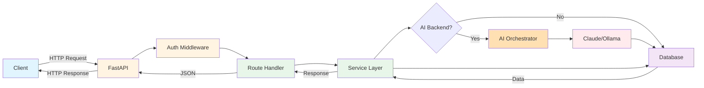

### **Typical Response Times**

| Flow Type | Layers Involved | Target Time | Notes |
|-----------|----------------|-------------|-------|
| Simple CRUD | Client → API → Service → DB | < 100ms | Direct database operations |
| AI Analysis | Client → API → Service → AI → DB | 3-5s | External AI API call |
| Consciousness Check | Background → Service → AI → DB | 5-10s | Multiple AI calls, pattern analysis |
| Task Accept | Client → API → Service → DB | < 300ms | Multiple database writes |

---

## Authentication Flow

Every API request requires authentication via Bearer token.

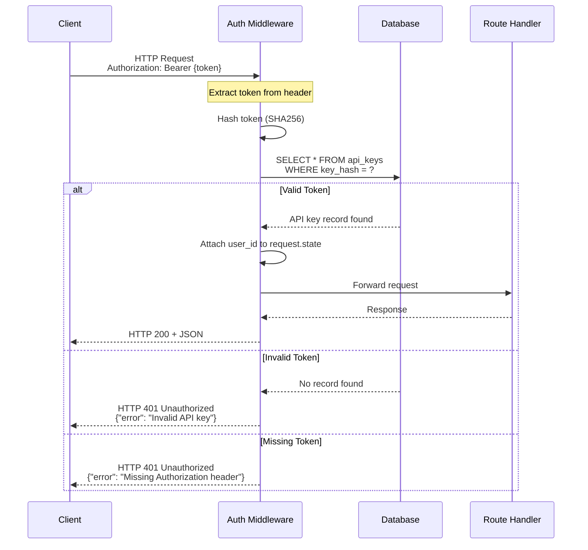

### **Authentication Implementation**

```python
# src/api/dependencies.py

async def verify_api_key(
    authorization: str = Header(None)
) -> str:
    """
    Dependency for API key authentication.
    
    Returns user_id if valid, raises 401 if invalid.
    """
    if not authorization:
        raise HTTPException(401, "Missing Authorization header")
    
    if not authorization.startswith("Bearer "):
        raise HTTPException(401, "Invalid authorization format")
    
    token = authorization.replace("Bearer ", "")
    
    # Hash token
    token_hash = hashlib.sha256(token.encode()).hexdigest()
    
    # Query database
    db = next(get_db())
    api_key = db.query(APIKeyDB).filter(
        APIKeyDB.key_hash == token_hash,
        APIKeyDB.is_active == True
    ).first()
    
    if not api_key:
        raise HTTPException(401, "Invalid API key")
    
    # Update last_used_at
    api_key.last_used_at = datetime.utcnow()
    db.commit()
    
    return api_key.user_id
```

---

## Thought Capture Flow

The most common operation: capturing a new thought from the user.

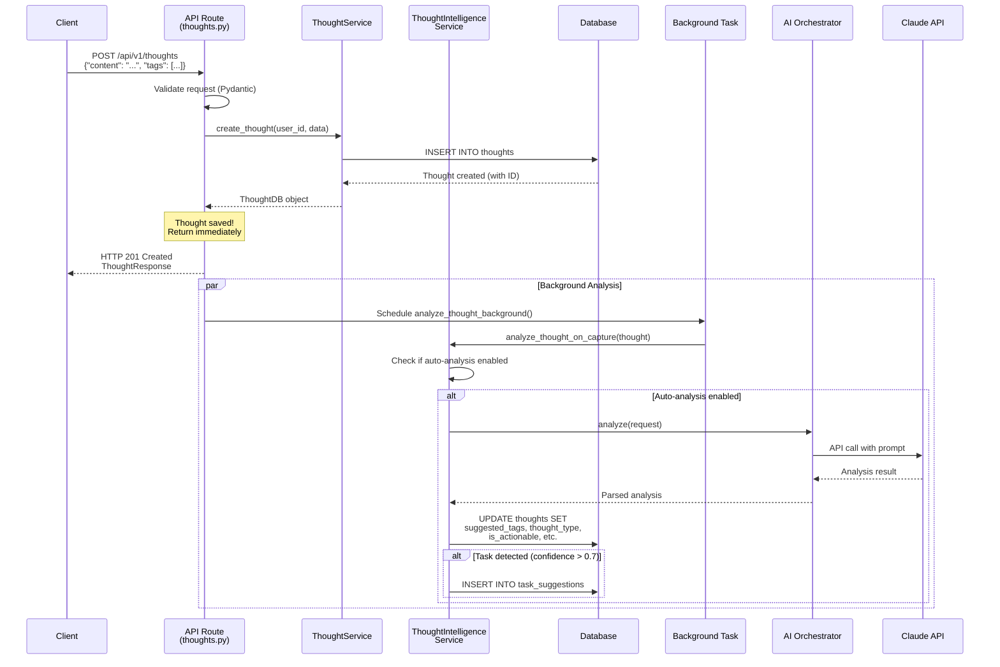

### **Key Points**

1. **Immediate Response:** Thought saved to database first, API returns immediately (< 100ms)
2. **Background Analysis:** AI analysis happens asynchronously via background task
3. **Conditional AI:** Only analyzes if `auto_tagging_enabled` or `auto_task_creation_enabled` is true
4. **Task Detection:** If AI determines thought is actionable with high confidence, creates task suggestion

### **Thought Capture Implementation**

```python
# src/api/routes/thoughts.py

@router.post("/thoughts", response_model=ThoughtResponse, status_code=201)
async def create_thought(
    thought_create: ThoughtCreate,
    user_id: str = Depends(verify_api_key),
    db: Session = Depends(get_db),
    background_tasks: BackgroundTasks = BackgroundTasks()
):
    """
    Create new thought.
    
    1. Validate input (Pydantic)
    2. Save to database (immediate)
    3. Return response (< 100ms)
    4. Trigger background AI analysis (async)
    """
    # Create thought via service
    thought = thought_service.create_thought(
        db=db,
        user_id=UUID(user_id),
        thought_create=thought_create
    )
    
    # Schedule background analysis (doesn't block response)
    background_tasks.add_task(
        analyze_thought_background,
        thought_id=UUID(thought.id),
        user_id=UUID(user_id),
        orchestrator=ai_orchestrator,
        db_factory=get_db_context
    )
    
    return thought.to_response()
```

---

## AI Analysis Flow

How AI analysis is orchestrated with fallback backends.

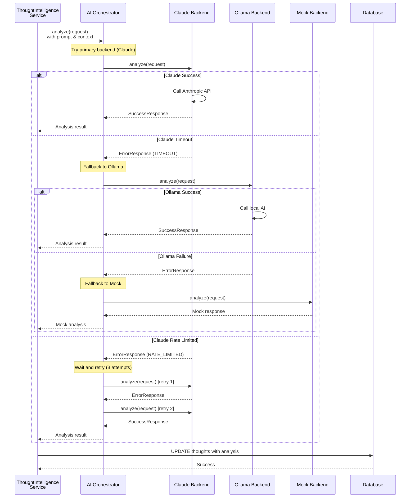

### **Backend Selection Logic**

```python
# src/services/ai_backends/orchestrator.py

async def analyze(self, request: BackendRequest) -> SuccessResponse:
    """
    Orchestrate backend selection with fallback.
    
    Order:
    1. Primary backend (Claude)
    2. Secondary backend (Ollama, if configured)
    3. Mock backend (testing/fallback)
    
    Retry logic:
    - Timeout: Try next backend
    - Rate limited: Wait and retry (3 attempts)
    - Unavailable: Try next backend
    """
    backends_to_try = [
        self.primary_backend,
        self.secondary_backend,
        self.mock_backend
    ]
    
    for backend in backends_to_try:
        if not backend:
            continue
        
        try:
            result = await backend.analyze(request)
            
            if isinstance(result, SuccessResponse):
                return result
            
            # Handle retryable errors
            if result.error.error_code == "RATE_LIMITED":
                await asyncio.sleep(5)  # Wait before retry
                result = await backend.analyze(request)
                if isinstance(result, SuccessResponse):
                    return result
        
        except Exception as e:
            logger.warning(f"Backend {backend.name} failed: {e}")
            continue
    
    # All backends failed
    raise AllBackendsFailedError()
```

---

## Task Suggestion Flow

AI detects actionable thought and creates task suggestion.

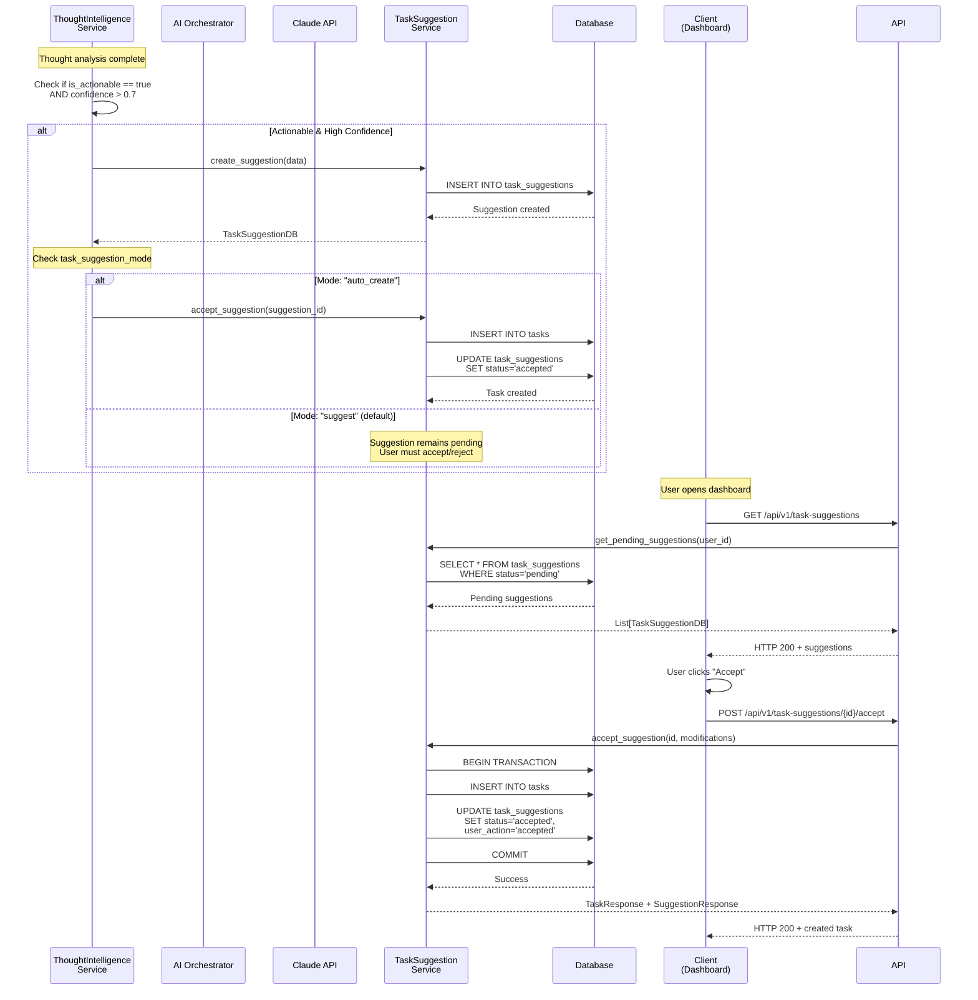

### **Task Suggestion Modes**

| Mode | Behavior | User Experience |
|------|----------|-----------------|
| **disabled** | No suggestions created | AI analysis doesn't create suggestions |
| **suggest** (default) | Suggestions created, pending user approval | User sees suggestions, must accept/reject |
| **auto_create** | Suggestions auto-accepted, task created immediately | Task appears instantly after thought capture |

---

## Consciousness Check Flow

Periodic analysis of recent thoughts to surface patterns and insights.

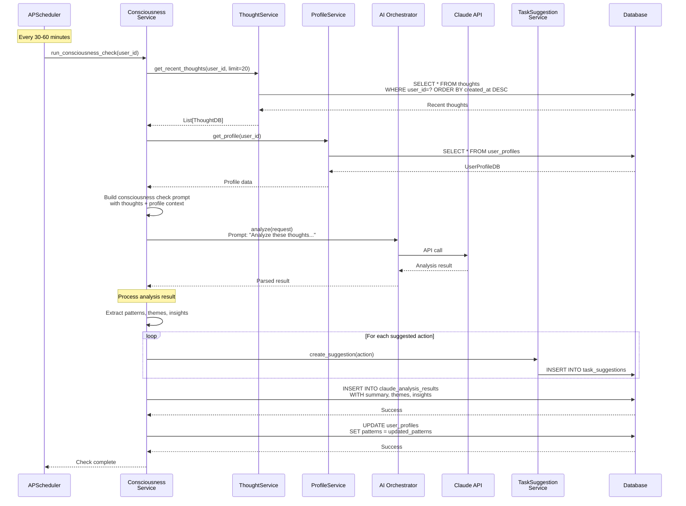

### **Consciousness Check Prompt Template**

```python
# src/services/ai_backends/prompts.py

def build_consciousness_check_prompt(
    recent_thoughts: List[ThoughtDB],
    user_profile: UserProfileDB,
    time_window: str
) -> str:
    """
    Build comprehensive consciousness check prompt.
    
    Includes:
    - Recent thoughts (last 24 hours typically)
    - User profile context (projects, patterns)
    - Previous insights (for continuity)
    """
    return f"""
    You are Andy's Personal AI Assistant performing a consciousness check.
    
    **About Andy:**
    {format_user_profile(user_profile)}
    
    **Recent Thoughts ({time_window}):**
    {format_thoughts_for_analysis(recent_thoughts)}
    
    **Previous Patterns:**
    {user_profile.work_patterns}
    
    **Your Task:**
    Analyze these thoughts and provide:
    1. **Themes:** What patterns do you see?
    2. **Insights:** What can Andy learn from this?
    3. **Suggested Actions:** What should Andy do next?
    4. **Concerns:** Anything Andy should be aware of?
    
    Be warm, encouraging, and helpful. Andy has ADHD, so actionable
    insights are more valuable than abstract observations.
    
    Respond in JSON format: {{
      "summary": "Brief overview...",
      "themes": ["theme1", "theme2"],
      "insights": ["insight1", "insight2"],
      "suggested_actions": [
        {{"action": "...", "priority": "high/medium/low"}},
      ],
      "concerns": ["concern1"] // Optional
    }}
    """
```

---

## Task Management Flow

Creating, updating, and completing tasks.

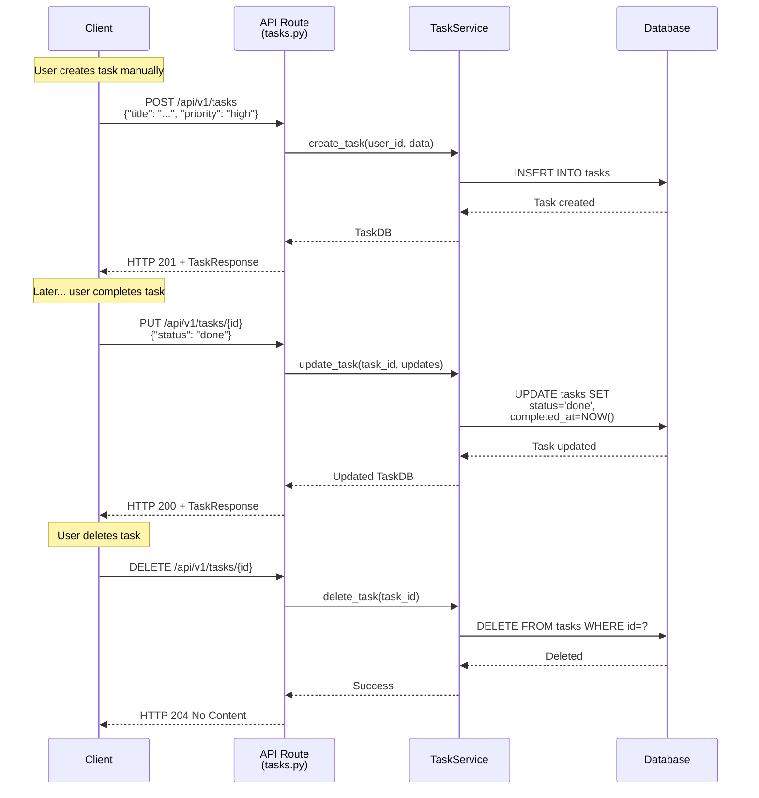

### **Task Status Lifecycle**

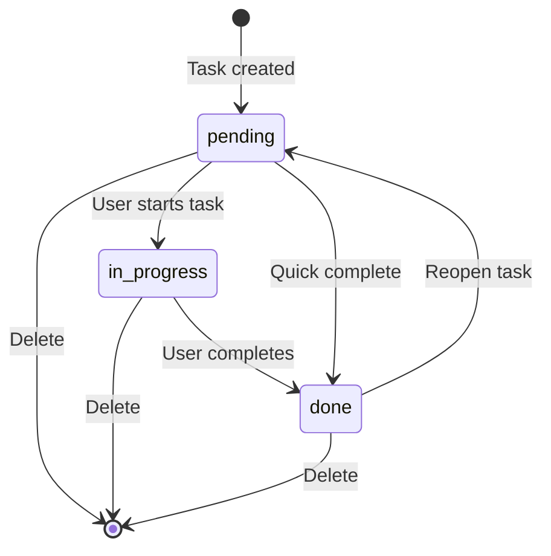

---

## Settings Management Flow

User updates their AI analysis preferences.

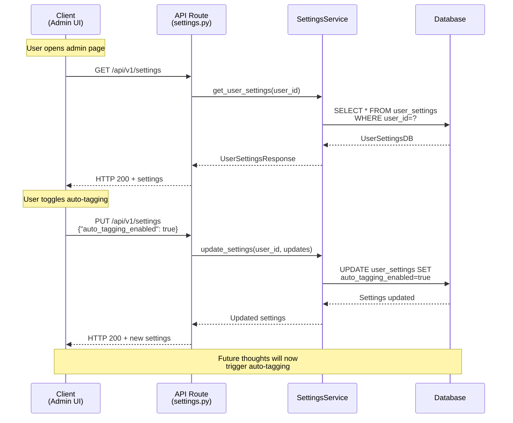

### **Settings Impact on Data Flow**

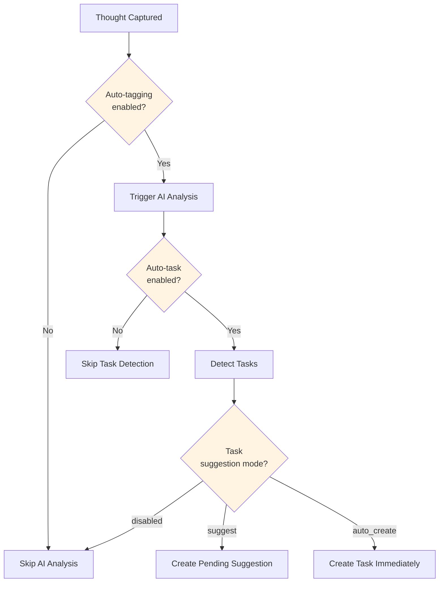

---

## Error Handling Flow

How errors are caught and returned to the client.

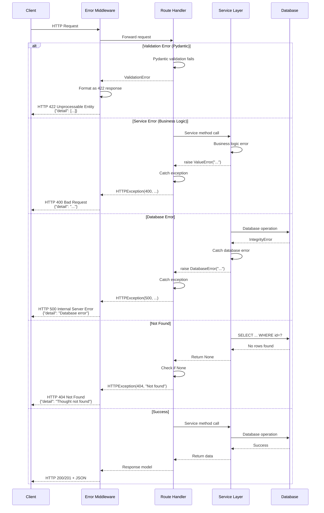

### **Error Response Format**

All errors follow FastAPI's standard format:

```json
{
  "detail": "Error message here"
}

// Or for validation errors:
{
  "detail": [
    {
      "loc": ["body", "content"],
      "msg": "field required",
      "type": "value_error.missing"
    }
  ]
}
```

### **Custom Exception Handling**

```python
# src/api/main.py

@app.exception_handler(ValueError)
async def value_error_handler(request: Request, exc: ValueError):
    """Handle business logic errors"""
    return JSONResponse(
        status_code=400,
        content={"detail": str(exc)}
    )

@app.exception_handler(DatabaseError)
async def database_error_handler(request: Request, exc: DatabaseError):
    """Handle database errors"""
    logger.error(f"Database error: {exc}")
    return JSONResponse(
        status_code=500,
        content={"detail": "Database error occurred"}
    )
```

---

## Background Job Flow

How scheduled jobs (consciousness checks) are executed.

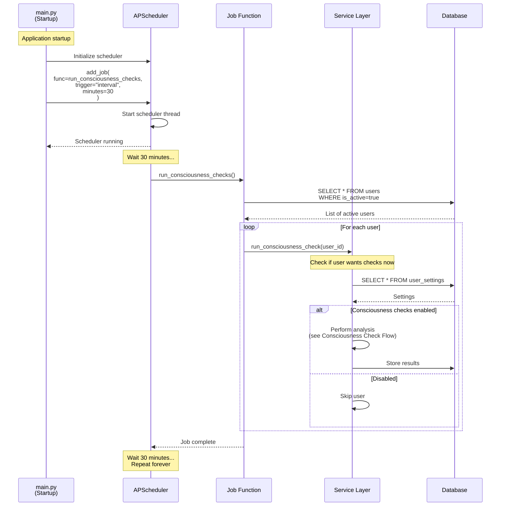

### **Scheduler Configuration**

```python
# src/api/main.py

from apscheduler.schedulers.asyncio import AsyncIOScheduler

scheduler = AsyncIOScheduler()

@app.on_event("startup")
async def startup_event():
    """Start background scheduler on app startup"""
    
    # Add consciousness check job
    scheduler.add_job(
        func=run_all_consciousness_checks,
        trigger="interval",
        minutes=30,  # Configurable via settings
        id="consciousness_checks",
        replace_existing=True
    )
    
    scheduler.start()
    logger.info("⏰ Background scheduler started")

@app.on_event("shutdown")
async def shutdown_event():
    """Stop scheduler on app shutdown"""
    scheduler.shutdown()
    logger.info("⏰ Scheduler stopped")
```

---

## Data Flow Optimization

### **Caching Strategy** (Future)

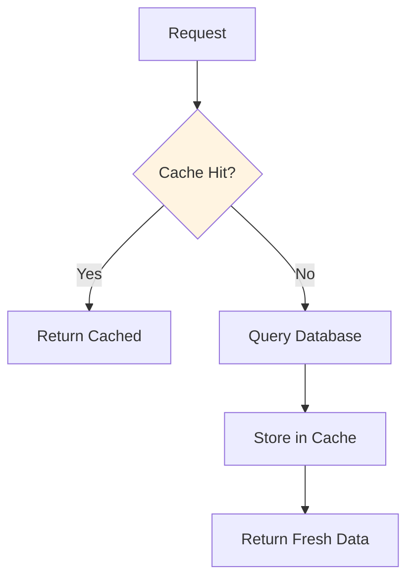

**Potential Cache Targets:**
- User settings (high read, low write)
- User profiles (high read, low write)
- Recent thoughts (read-heavy on dashboard load)

**Not Cached:**
- Thought creation (write operation)
- Task updates (need immediate consistency)
- AI analysis results (unique per request)

### **Database Query Optimization**

```sql
-- Indexed queries (fast)
SELECT * FROM thoughts 
WHERE user_id = ? 
ORDER BY created_at DESC 
LIMIT 20;
-- Uses: idx_thoughts_user_id, idx_thoughts_created_at

-- Full-text search (slower but acceptable)
SELECT * FROM thoughts 
WHERE user_id = ?
  AND (
    content LIKE '%keyword%' 
    OR tags::text LIKE '%keyword%'
  )
LIMIT 50;
-- Sequential scan on content (no FTS yet)
```

---

## Related Documentation

- [System Architecture](BACKEND_SYSTEM_ARCHITECTURE.md) - Component overview
- [File Organization](BACKEND_FILE_ORGANIZATION.md) - File inventory
- [Component Details](BACKEND_COMPONENT_DETAILS.md) - API/service details
- [API Documentation](http://localhost:8000/docs) - Interactive OpenAPI docs

---

**Document Version:** 1.0  
**Last Updated:** January 4, 2026  
**Maintained By:** Andy (@EldestGruff)
