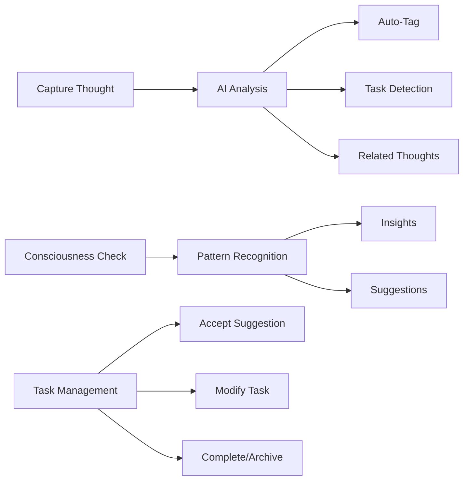
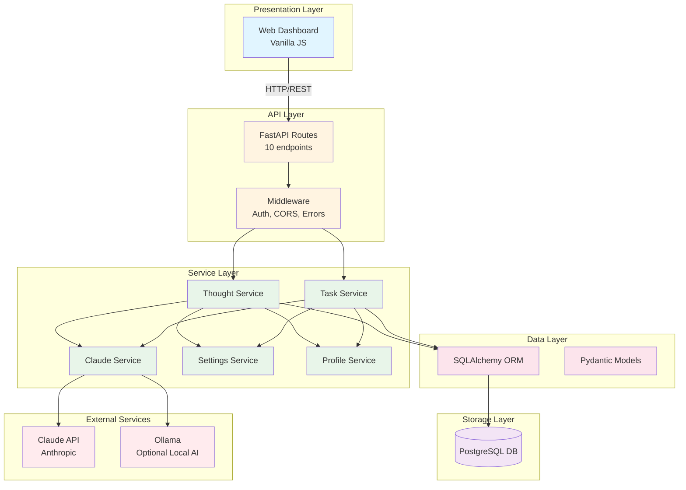
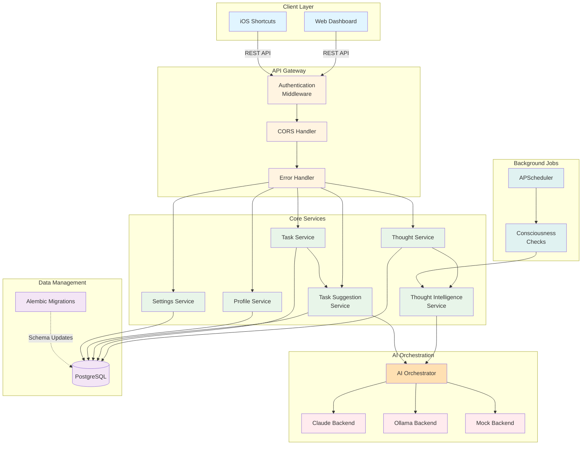
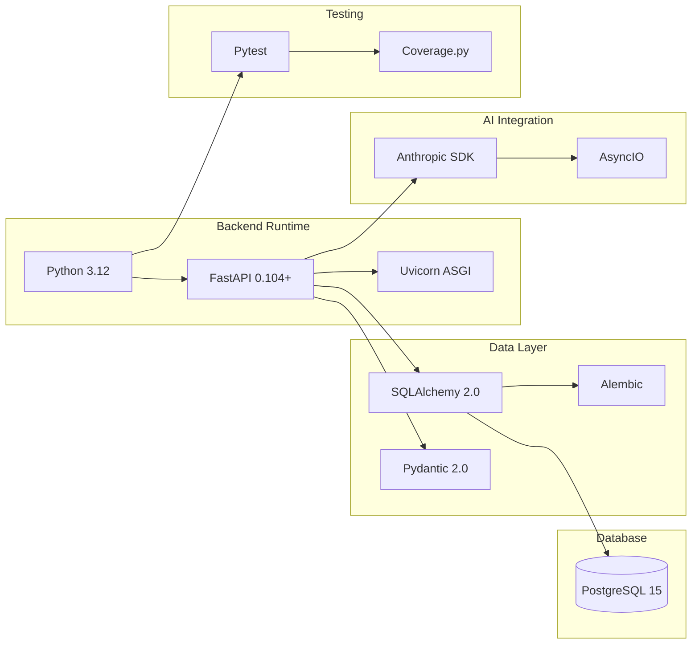
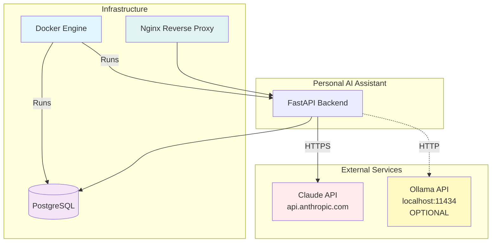
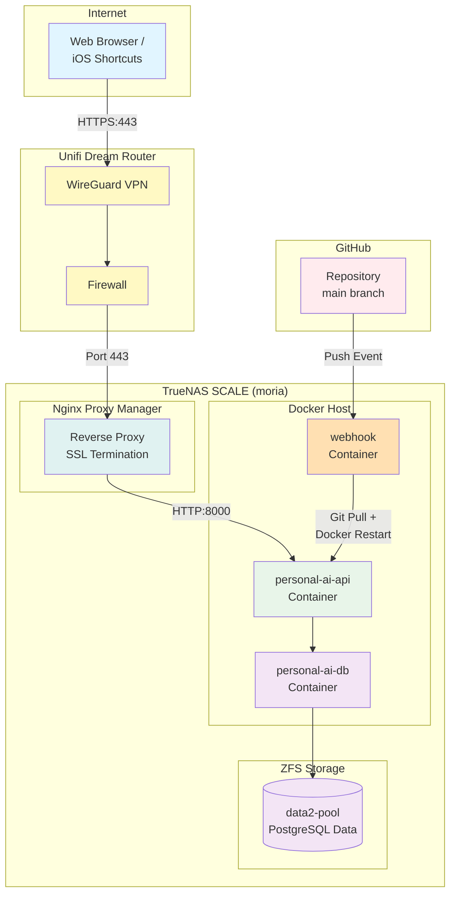
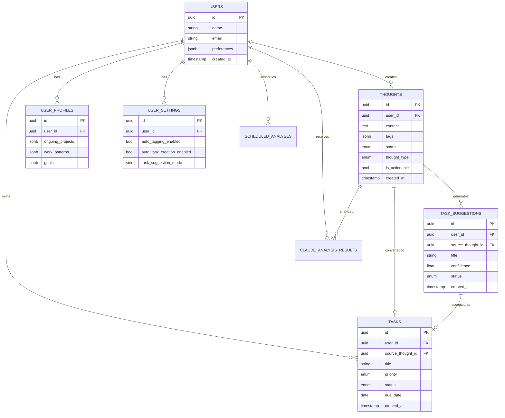
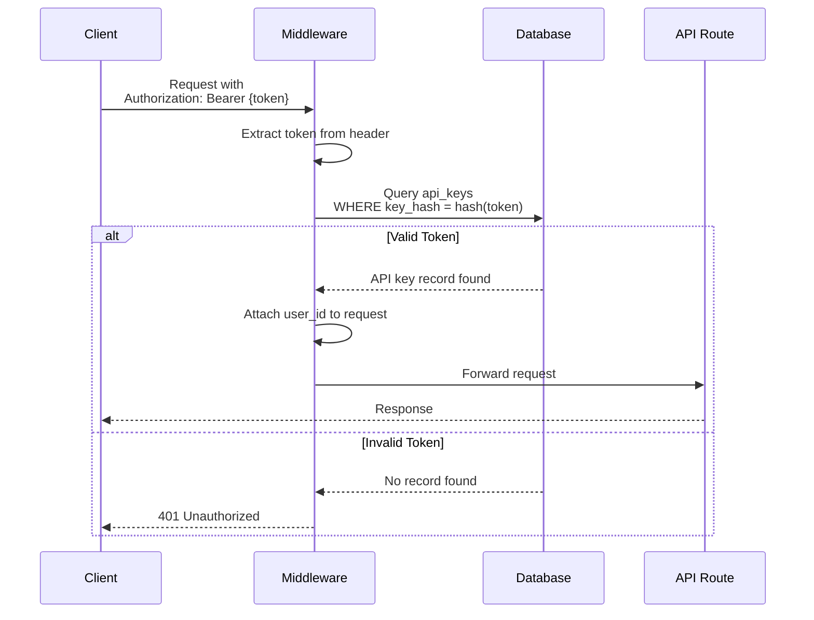
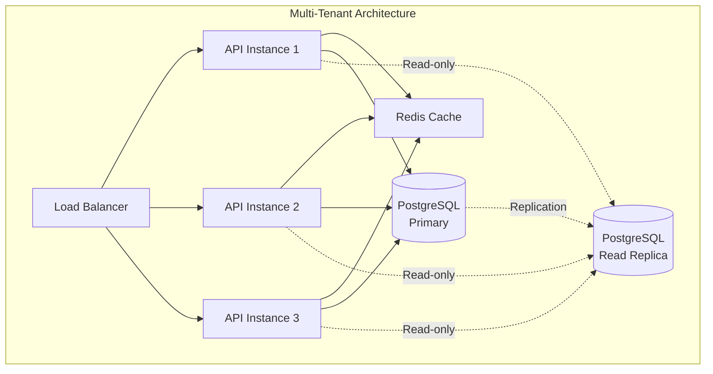

# Backend System Architecture

**Personal AI Assistant - System Architecture Overview**

**Last Updated:** January 4, 2026  
**Version:** 0.1.0  
**Status:** Phase 3B Complete

---

## Table of Contents

1. [System Overview](#system-overview)
2. [Architecture Layers](#architecture-layers)
3. [Component Diagram](#component-diagram)
4. [Technology Stack](#technology-stack)
5. [External Dependencies](#external-dependencies)
6. [Deployment Architecture](#deployment-architecture)
7. [Data Storage Strategy](#data-storage-strategy)
8. [Security & Authentication](#security--authentication)

---

## System Overview

The Personal AI Assistant is a **three-tier web application** designed to capture, analyze, and surface thoughts using AI-powered intelligence. The system follows a modern FastAPI-based REST architecture with clear separation of concerns.

### **Design Goals**

1. **Fast Capture:** < 1 second from API call to database (ADHD-friendly)
2. **AI-Enhanced:** Automatic tagging, task detection, and pattern recognition
3. **Production-Ready:** 80%+ test coverage, comprehensive error handling
4. **Self-Hosted:** Complete control over data and privacy
5. **Mobile-First:** Responsive web interface accessible from any device

### **Core Use Cases**



---

## Architecture Layers

The system is organized into **5 distinct layers**, each with clear responsibilities:



### **Layer Responsibilities**

| Layer | Technology | Responsibilities |
|-------|-----------|-----------------|
| **Presentation** | Vanilla JS, HTML5, CSS3 | User interface, form handling, state management |
| **API** | FastAPI, Pydantic | Request validation, response formatting, routing |
| **Service** | Python async functions | Business logic, orchestration, AI integration |
| **Data** | SQLAlchemy, Pydantic | ORM models, validation, serialization |
| **Storage** | PostgreSQL | Persistent data, ACID transactions, indexes |

---

## Component Diagram

### **High-Level System Components**



### **Component Descriptions**

#### **Client Layer**
- **Web Dashboard:** Primary user interface (vanilla JS, mobile-first design)
- **iOS Shortcuts:** Quick-capture integration for iPhone/iPad

#### **API Gateway**
- **Authentication:** Bearer token validation (UUID-based API keys)
- **CORS:** Cross-origin resource sharing for web clients
- **Error Handler:** Standardized error responses with proper HTTP codes

#### **Core Services**
- **Thought Service:** CRUD operations, search, tagging
- **Task Service:** Task management, status tracking
- **Task Suggestion Service:** AI-generated task suggestions with confidence scores
- **Profile Service:** User preferences, patterns, ongoing projects
- **Settings Service:** System configuration, AI backend selection
- **Thought Intelligence Service:** Auto-tagging, task detection, analysis orchestration

#### **AI Orchestration**
- **AI Orchestrator:** Backend selection, fallback logic, retry handling
- **Claude Backend:** Anthropic API integration (primary AI)
- **Ollama Backend:** Local AI integration (optional, fallback)
- **Mock Backend:** Testing and development

#### **Background Jobs**
- **APScheduler:** Periodic task execution
- **Consciousness Checks:** Scheduled thought analysis (every 30-60 minutes)

---

## Technology Stack

### **Core Technologies**



### **Technology Decisions**

| Technology | Version | Rationale |
|-----------|---------|-----------|
| **Python** | 3.12+ | Modern async/await, type hints, performance |
| **FastAPI** | 0.104+ | Async native, automatic OpenAPI docs, Pydantic integration |
| **PostgreSQL** | 15 | ACID compliance, robust indexing, production-ready |
| **SQLAlchemy** | 2.0 | Modern ORM, async support, type-safe |
| **Pydantic** | 2.0 | Data validation, serialization, type safety |
| **Uvicorn** | Latest | Fast ASGI server, async support |
| **Alembic** | Latest | Database migrations, version control |

### **Why NOT These Alternatives?**

| Rejected | Reason |
|----------|--------|
| ~~SQLite~~ | Originally planned, but PostgreSQL chosen for better concurrency and production features |
| ~~Node.js~~ | Python ecosystem better for AI/ML integration |
| ~~Django~~ | Too heavyweight, FastAPI's async + OpenAPI better fit |
| ~~MongoDB~~ | Relational data (thoughts → tasks → tags) fits SQL better |

---

## External Dependencies

### **Required Services**



### **Claude API Integration**

- **Provider:** Anthropic (https://www.anthropic.com)
- **Model:** Claude 3.5 Sonnet (primary), Claude 3 Haiku (fallback)
- **Usage:** Thought analysis, tagging, task detection, consciousness checks
- **Rate Limits:** 100 requests/minute (configurable)
- **Cost:** ~$3/million input tokens, ~$15/million output tokens

### **Ollama Integration (Optional)**

- **Provider:** Local installation (https://ollama.ai)
- **Models:** Llama 3, Mistral, others
- **Usage:** Fallback when Claude unavailable, offline mode
- **Cost:** Free (runs locally on GPU/CPU)

### **Configuration**

```bash
# .env file
ANTHROPIC_API_KEY=sk-ant-...
OLLAMA_BASE_URL=http://localhost:11434  # Optional
OLLAMA_MODEL=llama3  # Optional
```

---

## Deployment Architecture

### **Production Deployment (TrueNAS SCALE)**



### **Network Architecture**

| Component | URL/Address | Purpose |
|-----------|------------|---------|
| **Public URL** | https://ai.gruff.edu | External access via Let's Encrypt SSL |
| **Nginx Proxy** | Internal routing | SSL termination, reverse proxy |
| **API Container** | http://moria:8000 | FastAPI backend |
| **DB Container** | postgresql://moria:5432 | PostgreSQL database |
| **Dashboard** | https://ai.gruff.edu/dashboard | Web UI |

### **Security Layers**

1. **Network:** WireGuard VPN for remote access
2. **SSL:** Let's Encrypt certificates via Nginx
3. **Authentication:** Bearer token (UUID) for API access
4. **Firewall:** Unifi Dream Router rules
5. **Docker:** Container isolation

---

## Data Storage Strategy

### **Database Schema Overview**



### **Data Retention**

| Table | Retention Policy | Rationale |
|-------|-----------------|-----------|
| **thoughts** | Indefinite | Core data, user may want years of history |
| **tasks** | Indefinite | Task history provides context |
| **task_suggestions** | 90 days (soft delete) | Historical suggestions less valuable over time |
| **claude_analysis_results** | 30 days | Audit trail, debugging |
| **scheduled_analyses** | 7 days | Recent patterns only |

### **Backup Strategy**

- **ZFS Snapshots:** Every 6 hours (automatic)
- **Database Dumps:** Daily at 2 AM UTC
- **Retention:** 30 days of snapshots
- **Recovery:** Point-in-time restore available

---

## Security & Authentication

### **Authentication Flow**



### **Security Measures**

| Layer | Protection |
|-------|-----------|
| **Transport** | HTTPS (Let's Encrypt), WireGuard VPN |
| **Authentication** | Bearer tokens (UUID), hashed storage |
| **Authorization** | User-scoped queries (user_id filtering) |
| **Input Validation** | Pydantic models, SQL injection prevention |
| **Rate Limiting** | 100 req/min per token (configurable) |
| **Error Handling** | No sensitive data in error messages |
| **Database** | Parameterized queries (SQLAlchemy ORM) |
| **Secrets** | Environment variables (.env files) |

### **API Key Management**

```python
# API keys are:
# - Generated as UUIDs
# - Hashed with SHA256 before storage
# - Never logged in plain text
# - Rotatable via admin API

# Example key:
# Plain:  550e8400-e29b-41d4-a716-446655440000
# Stored: 3d8c2f1a... (SHA256 hash)
```

---

## System Monitoring

### **Health Checks**

```bash
# API health endpoint
GET /api/v1/health

Response:
{
  "status": "healthy",
  "version": "0.1.0",
  "database": "connected",
  "uptime_seconds": 3600,
  "timestamp": "2026-01-04T12:00:00Z"
}
```

### **Logging**

- **Level:** INFO (production), DEBUG (development)
- **Format:** JSON structured logs
- **Destinations:** Docker logs (stdout), rotated log files
- **Retention:** 30 days

### **Metrics** (Future)

- Request latency (p50, p95, p99)
- Error rates by endpoint
- Claude API token usage
- Database query performance
- Background job success/failure rates

---

## Performance Characteristics

### **API Response Times** (Target)

| Endpoint | Target | Actual |
|----------|--------|--------|
| GET /thoughts | < 100ms | ~50ms |
| POST /thoughts | < 200ms | ~80ms |
| POST /consciousness-check | < 5000ms | ~3000ms |
| GET /tasks | < 100ms | ~40ms |
| POST /task-suggestions/accept | < 300ms | ~150ms |

### **Scalability Limits** (Current Architecture)

- **Concurrent Users:** ~50 (single API container)
- **Thoughts/Day:** ~10,000 (tested)
- **AI Analysis/Hour:** ~100 (Claude rate limits)
- **Database Size:** Tested to 1M thoughts (~5GB)

### **Bottlenecks Identified**

1. **Claude API:** 3-5 second latency per request (external service)
2. **Database Writes:** Single PostgreSQL instance (not replicated)
3. **API Container:** Single instance (no load balancing)

**Mitigation:** Background job processing for AI analysis, async/await throughout stack

---

## Future Architecture Considerations

### **Planned Improvements**

1. **API Load Balancing:** Multiple API containers behind Nginx
2. **Database Replication:** PostgreSQL streaming replication
3. **Caching Layer:** Redis for frequently accessed data
4. **Message Queue:** RabbitMQ/Celery for background jobs
5. **Local AI:** Ollama integration for offline operation

### **Multi-Tenant Support** (Phase 4+)



---

## Related Documentation

- [File Organization](BACKEND_FILE_ORGANIZATION.md) - Complete file inventory
- [Data Flow](BACKEND_DATA_FLOW.md) - Request/response flows
- [Component Details](BACKEND_COMPONENT_DETAILS.md) - Detailed component breakdown
- [API Documentation](http://localhost:8000/docs) - Interactive OpenAPI docs

---

**Document Version:** 1.0  
**Last Updated:** January 4, 2026  
**Maintained By:** Andy (@EldestGruff)
